# 🛍️ AuraMart

<p align="center">
  
</p>

<p align="center">
A modern full-stack e-commerce platform built with React, TypeScript, Node.js, Express, and MongoDB. AuraMart provides a complete shopping experience with customer, seller, delivery, and administrator portals.
</p>

<p align="center">
<a href="https://auramart-5dcv.onrender.com/">🌐 Live Demo</a> •
<a href="https://github.com/keshabthapa2062/AuraMart">📂 Repository</a>
</p>

---

## ✨ Features

### Customer

- User Authentication
- Product Search
- Product Categories
- Shopping Cart
- Secure Checkout
- Order History
- User Dashboard
- AI Shopping Assistant
- Wishlist
- Email Notifications

### Seller

- Seller Registration
- Seller Dashboard
- Product Management
- Revenue Dashboard

### Delivery

- Delivery Portal
- Order Assignment
- Delivery OTP Verification
- Delivery Status Updates

### Administrator

- Admin Console
- User Management
- Product Management
- Seller Approval
- Order Management

---

# 🛠 Tech Stack

## Frontend

- React
- TypeScript
- Vite
- Tailwind CSS

## Backend

- Node.js
- Express.js
- TypeScript

## Database

- MongoDB Atlas

## Authentication

- JWT
- bcrypt

## Additional Libraries

- TanStack Query
- Recharts
- Nodemailer
- Google Gemini API

---

# 📂 Project Structure

```text
AuraMart
│
├── backend
│   └── src
│       ├── add_product.ts
│       ├── db.ts
│       ├── mailer.ts
│       ├── migrate.ts
│       ├── seed_real_products.ts
│       └── server.ts
│
├── docs
│   └── screenshots
│
├── frontend
│   ├── src
│   │   ├── components
│   │   │   ├── AdminDashboard.tsx
│   │   │   ├── AIAssistant.tsx
│   │   │   ├── AuthModal.tsx
│   │   │   ├── CartDrawer.tsx
│   │   │   ├── CheckoutForm.tsx
│   │   │   ├── DeliveryPortal.tsx
│   │   │   ├── Navbar.tsx
│   │   │   ├── OrderHistory.tsx
│   │   │   ├── ProductCard.tsx
│   │   │   ├── ProductDetailsPage.tsx
│   │   │   ├── SellerDashboard.tsx
│   │   │   ├── UserDashboard.tsx
│   │   │   └── ...
│   │   │
│   │   ├── data
│   │   │   ├── auramart.png
│   │   │   └── categories.ts
│   │   │
│   │   ├── utils
│   │   │   ├── currency.ts
│   │   │   ├── deliverability.ts
│   │   │   ├── image.ts
│   │   │   ├── location.ts
│   │   │   └── search.ts
│   │   │
│   │   ├── App.tsx
│   │   ├── main.tsx
│   │   └── index.css
│   │
│   ├── index.html
│   ├── vite.config.ts
│   └── package.json
│
├── .gitignore
├── package.json
└── README.md
```

---

# 🚀 Getting Started

## Clone Repository

```bash
git clone https://github.com/keshabthapa2062/AuraMart.git

cd AuraMart
```

## Install Dependencies

```bash
npm install
```

or

```bash
yarn install
```

---

## Environment Variables

Create a `.env` file.

```env
MONGODB_URI=your_mongodb_connection_string

JWT_SECRET=your_secret_key

EMAIL_USER=your_email

EMAIL_PASSWORD=your_email_password

GEMINI_API_KEY=your_api_key
```

---

## Run Development Server

```bash
npm run dev
```

---

## Production Build

```bash
npm run build

npm start
```

---

# 📸 Application Screenshots

## Landing Page

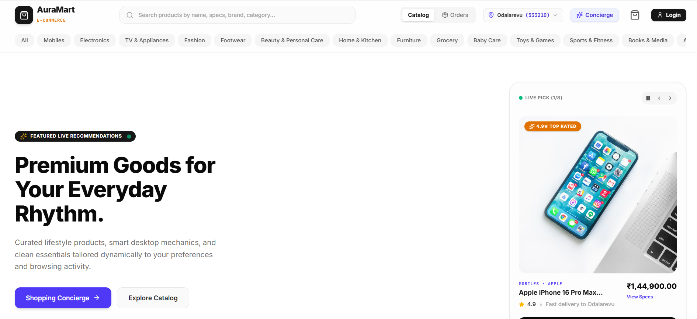

## Login Page

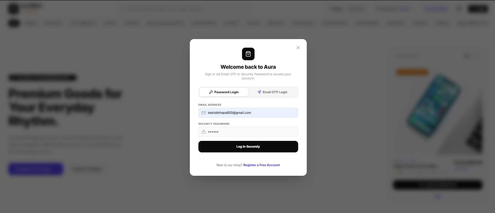

## Deals

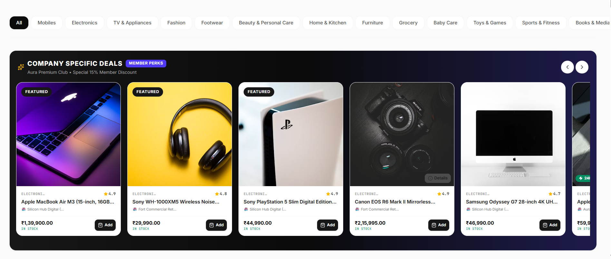

## Cart

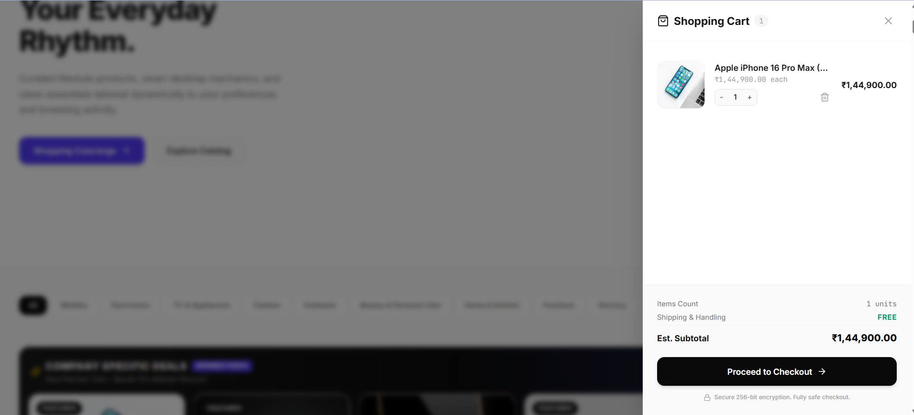

## Checkout


## Payment


## Order Completion

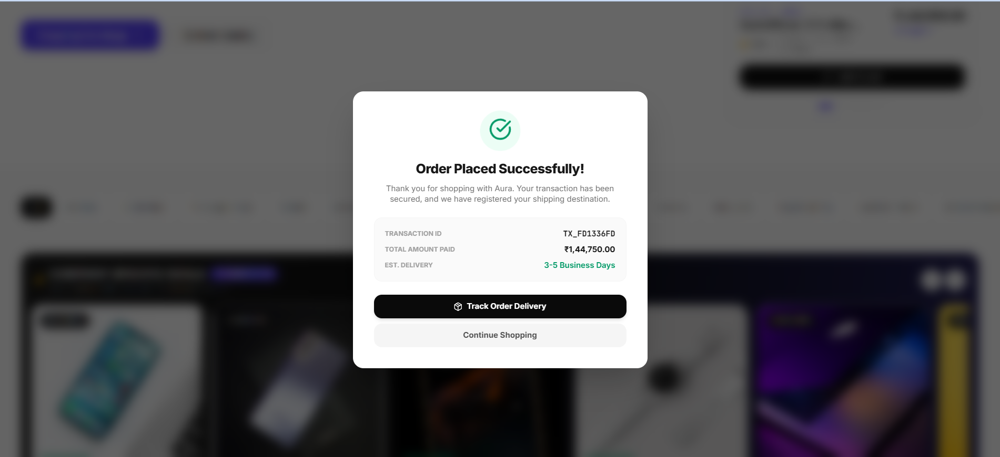

## Order History

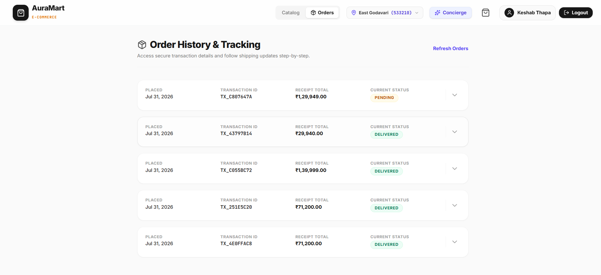

## User Dashboard

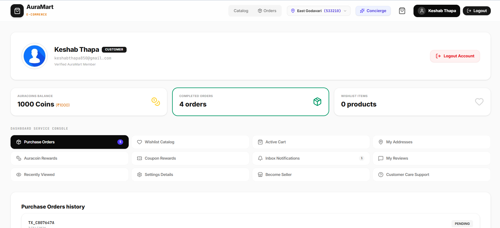

## Seller Dashboard

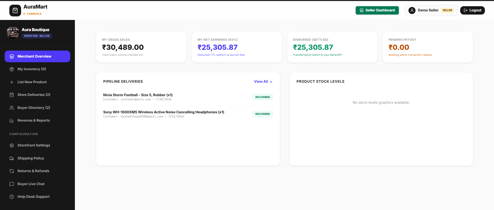

## Seller Revenue


## Delivery Portal

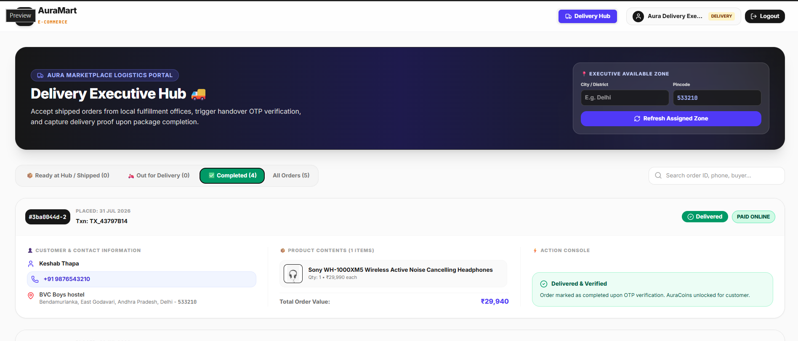

## Delivery OTP

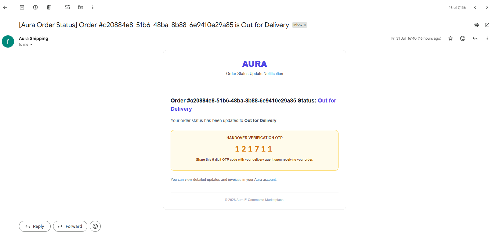

## Admin Console

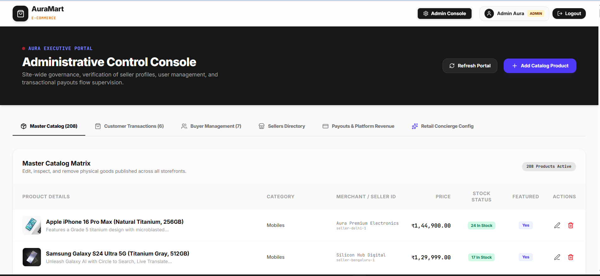

## Email Notification

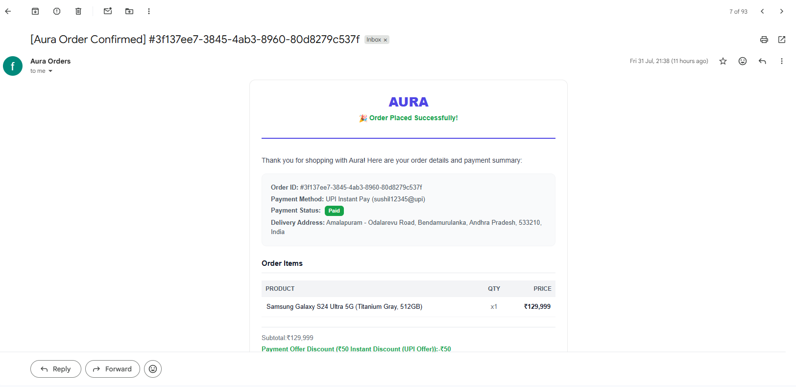

---

# 🌐 Live Demo

https://auramart-5dcv.onrender.com/

---

# 📌 Future Enhancements

- Online Payment Gateway
- Push Notifications
- Coupon System
- Product Recommendation Engine
- Multi-language Support
- Progressive Web App (PWA)

---

# 📄 License

This project is licensed under the MIT License.

---

# 👨‍💻 Author

**Keshab Thapa**

GitHub: https://github.com/keshabthapa2062

---

⭐ If you like this project, consider giving it a star.
